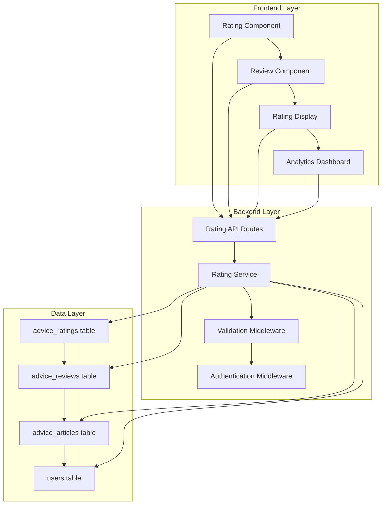
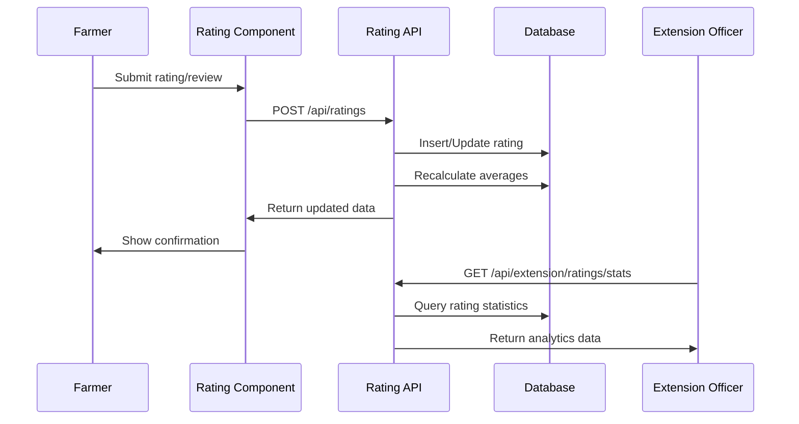

# Technical Design Document: Advice Rating System

## Overview

The Advice Rating System is a comprehensive feedback mechanism that enables farmers to evaluate expert farming advice through star ratings (1-5 stars) and detailed text reviews. This system integrates seamlessly with the existing AgriConnect platform's advice article functionality, providing valuable feedback loops between farmers and extension officers.

### Key Features
- **Star Rating Interface**: 5-star rating system for quick quality assessment
- **Text Reviews**: Detailed feedback with 1000-character limit
- **Rating Aggregation**: Real-time calculation of average ratings and review counts
- **Review Management**: Farmers can update their ratings and reviews
- **Analytics Dashboard**: Extension officers can view rating statistics for their articles
- **Performance Optimization**: Efficient database queries and caching for scalability

### Integration Points
- Extends existing `advice_articles` table with rating data
- Integrates with current farmer authentication system
- Enhances existing advice display components
- Adds rating analytics to extension officer dashboard

## Architecture

### System Architecture Overview

The rating system follows a three-tier architecture that integrates with the existing AgriConnect platform:



### Component Interaction Flow



## Components and Interfaces

### Frontend Components

#### 1. RatingInterface Component
**Location**: `frontend/src/components/RatingInterface.jsx`

**Props**:
```typescript
interface RatingInterfaceProps {
  articleId: number;
  currentRating?: number;
  currentReview?: string;
  onRatingSubmit: (rating: number, review: string) => void;
  disabled?: boolean;
}
```

**Responsibilities**:
- Render interactive 5-star rating interface
- Handle star click events and visual feedback
- Manage review text input with character counter
- Validate input before submission
- Display existing user ratings/reviews

#### 2. RatingDisplay Component
**Location**: `frontend/src/components/RatingDisplay.jsx`

**Props**:
```typescript
interface RatingDisplayProps {
  averageRating: number;
  reviewCount: number;
  reviews: Review[];
  showReviews?: boolean;
  compact?: boolean;
}
```

**Responsibilities**:
- Display average rating as filled/empty stars
- Show review count and "No ratings yet" states
- Render individual reviews with timestamps
- Handle review pagination for large datasets

#### 3. RatingAnalytics Component
**Location**: `frontend/src/components/RatingAnalytics.jsx`

**Props**:
```typescript
interface RatingAnalyticsProps {
  officerId: number;
  articles: ArticleWithRatings[];
}
```

**Responsibilities**:
- Display rating statistics for extension officers
- Show overall average across all articles
- List recent reviews and ratings
- Provide filtering and sorting options

### Backend API Endpoints

#### Rating Management Routes
**Base Path**: `/api/ratings`

```javascript
// Submit or update rating
POST /api/ratings
Body: { articleId, rating, review? }
Response: { success, data: RatingData }

// Get ratings for article
GET /api/ratings/article/:articleId
Response: { averageRating, reviewCount, reviews }

// Get user's rating for article
GET /api/ratings/article/:articleId/user
Response: { rating, review, createdAt }

// Delete user's rating
DELETE /api/ratings/article/:articleId/user
Response: { success }
```

#### Analytics Routes
**Base Path**: `/api/extension/ratings`

```javascript
// Get rating statistics for officer
GET /api/extension/ratings/stats
Response: { 
  totalRatings, 
  averageRating, 
  articleStats: ArticleRating[],
  recentReviews: Review[]
}

// Get detailed ratings for specific article
GET /api/extension/ratings/article/:articleId
Response: { 
  article, 
  ratings: DetailedRating[],
  statistics: RatingStats 
}
```

### Service Layer

#### RatingService
**Location**: `backend/services/ratingService.js`

**Key Methods**:
```javascript
class RatingService {
  async submitRating(userId, articleId, rating, review)
  async updateRating(userId, articleId, rating, review)
  async getRatingsByArticle(articleId, limit, offset)
  async getUserRating(userId, articleId)
  async deleteRating(userId, articleId)
  async calculateAverageRating(articleId)
  async getOfficerRatingStats(officerId)
}
```

**Responsibilities**:
- Handle rating CRUD operations
- Manage rating calculations and aggregations
- Implement business logic for rating constraints
- Provide data for analytics and reporting

## Data Models

### Database Schema Extensions

#### advice_ratings Table
```sql
CREATE TABLE advice_ratings (
  id SERIAL PRIMARY KEY,
  article_id INTEGER REFERENCES advice_articles(id) ON DELETE CASCADE,
  farmer_id INTEGER REFERENCES users(id) ON DELETE CASCADE,
  rating INTEGER NOT NULL CHECK (rating >= 1 AND rating <= 5),
  created_at TIMESTAMP DEFAULT CURRENT_TIMESTAMP,
  updated_at TIMESTAMP DEFAULT CURRENT_TIMESTAMP,
  UNIQUE(article_id, farmer_id)
);
```

#### advice_reviews Table
```sql
CREATE TABLE advice_reviews (
  id SERIAL PRIMARY KEY,
  article_id INTEGER REFERENCES advice_articles(id) ON DELETE CASCADE,
  farmer_id INTEGER REFERENCES users(id) ON DELETE CASCADE,
  review_text TEXT NOT NULL CHECK (LENGTH(TRIM(review_text)) > 0),
  created_at TIMESTAMP DEFAULT CURRENT_TIMESTAMP,
  updated_at TIMESTAMP DEFAULT CURRENT_TIMESTAMP,
  UNIQUE(article_id, farmer_id),
  CONSTRAINT review_length CHECK (LENGTH(review_text) <= 1000)
);
```

#### advice_articles Table Extensions
```sql
-- Add computed columns for performance
ALTER TABLE advice_articles 
ADD COLUMN average_rating DECIMAL(3,2) DEFAULT 0,
ADD COLUMN review_count INTEGER DEFAULT 0;
```

### Performance Indexes
```sql
-- Indexes for efficient queries
CREATE INDEX idx_ratings_article ON advice_ratings(article_id);
CREATE INDEX idx_ratings_farmer ON advice_ratings(farmer_id);
CREATE INDEX idx_ratings_created ON advice_ratings(created_at);
CREATE INDEX idx_reviews_article ON advice_reviews(article_id);
CREATE INDEX idx_reviews_farmer ON advice_reviews(farmer_id);
CREATE INDEX idx_reviews_created ON advice_reviews(created_at);

-- Composite indexes for common queries
CREATE INDEX idx_ratings_article_farmer ON advice_ratings(article_id, farmer_id);
CREATE INDEX idx_reviews_article_farmer ON advice_reviews(article_id, farmer_id);
```

### Data Transfer Objects

#### RatingData
```typescript
interface RatingData {
  id: number;
  articleId: number;
  farmerId: number;
  rating: number;
  review?: string;
  farmerName: string;
  createdAt: Date;
  updatedAt: Date;
}
```

#### RatingStats
```typescript
interface RatingStats {
  articleId: number;
  averageRating: number;
  reviewCount: number;
  ratingDistribution: {
    1: number;
    2: number;
    3: number;
    4: number;
    5: number;
  };
}
```

#### ArticleWithRatings
```typescript
interface ArticleWithRatings {
  id: number;
  title: string;
  content: string;
  category: string;
  authorName: string;
  createdAt: Date;
  averageRating: number;
  reviewCount: number;
  userRating?: number;
  userReview?: string;
}
```

## Correctness Properties

*A property is a characteristic or behavior that should hold true across all valid executions of a system-essentially, a formal statement about what the system should do. Properties serve as the bridge between human-readable specifications and machine-verifiable correctness guarantees.*

### Property 1: Star Rating Submission

*For any* farmer and advice article, when the farmer clicks on any star (1-5), the system should submit the corresponding rating value and prevent duplicate ratings for the same farmer-article pair.

**Validates: Requirements 1.2, 1.3**

### Property 2: Rating State Display and Updates

*For any* farmer who has rated an article, the system should display their existing rating and allow them to update it to any other valid rating value (1-5).

**Validates: Requirements 1.4, 1.5**

### Property 3: Review Text Validation

*For any* review submission, the system should accept reviews up to 1000 characters, reject empty or whitespace-only reviews, reject reviews containing only special characters or numbers, and trim whitespace before storage.

**Validates: Requirements 2.2, 5.1, 5.2, 5.3**

### Property 4: Review Storage and Uniqueness

*For any* valid review submission, the system should store the review with timestamp and farmer identification, and prevent multiple reviews from the same farmer for the same article while allowing updates to existing reviews.

**Validates: Requirements 2.3, 2.4, 2.5**

### Property 5: Rating Calculation Accuracy

*For any* advice article, when ratings are added or updated, the system should recalculate the average rating correctly and round it to one decimal place for display.

**Validates: Requirements 4.1, 4.2, 4.4**

### Property 6: Review Count Maintenance

*For any* advice article, the displayed review count should always match the actual number of reviews stored for that article, updating immediately when reviews are added, modified, or deleted.

**Validates: Requirements 4.3**

### Property 7: Star Rating Display

*For any* advice article or individual review, the system should display star ratings as filled/empty stars corresponding to the rating value, with average ratings shown for articles and individual ratings shown for reviews.

**Validates: Requirements 3.1, 3.6**

### Property 8: Review Chronological Ordering

*For any* set of reviews for an article, the system should display them in chronological order with newest first, and each review should include the reviewer's name and review date.

**Validates: Requirements 3.4, 3.5**

### Property 9: Error Message Display

*For any* invalid review submission, the system should display a descriptive error message explaining why the submission was rejected.

**Validates: Requirements 5.4**

### Property 10: Cascade Deletion

*For any* advice article that is deleted, the system should remove all associated ratings and reviews, while preserving ratings and reviews when articles are updated.

**Validates: Requirements 6.3, 6.4**

### Property 11: Officer Analytics Accuracy

*For any* extension officer, the system should display accurate rating statistics including average ratings and review counts for each of their articles, plus an overall average across all articles.

**Validates: Requirements 7.2, 7.3, 7.4**

### Property 12: Recent Reviews Display

*For any* extension officer, the system should display recent reviews received on their articles in chronological order.

**Validates: Requirements 7.5**

### Property 13: Concurrent Rating Safety

*For any* concurrent rating submissions for the same article, the system should handle them without data corruption, ensuring all ratings are properly recorded and averages are calculated correctly.

**Validates: Requirements 8.4**

## Error Handling

### Input Validation Errors

#### Rating Validation
- **Invalid Rating Range**: Ratings outside 1-5 range are rejected with error message "Rating must be between 1 and 5 stars"
- **Missing Article ID**: Requests without valid article ID return "Article not found" error
- **Unauthorized Access**: Non-farmer users attempting to rate return "Only farmers can rate advice articles"

#### Review Validation
- **Empty Review**: Empty or whitespace-only reviews return "Review cannot be empty"
- **Review Too Long**: Reviews exceeding 1000 characters return "Review must be 1000 characters or less"
- **Invalid Content**: Reviews with only special characters/numbers return "Review must contain meaningful text"
- **Duplicate Review**: Attempts to submit multiple reviews return "You have already reviewed this article. You can edit your existing review."

### Database Errors

#### Connection Errors
- **Database Unavailable**: Return "Service temporarily unavailable. Please try again later."
- **Query Timeout**: Return "Request timed out. Please try again."
- **Constraint Violations**: Return appropriate user-friendly messages for database constraint failures

#### Data Integrity Errors
- **Orphaned Ratings**: Ratings for non-existent articles are automatically cleaned up
- **Invalid User References**: Ratings from deleted users are preserved but marked as "Anonymous"
- **Concurrent Modifications**: Use database transactions to prevent race conditions during rating calculations

### API Error Responses

#### Standard Error Format
```json
{
  "error": true,
  "message": "Human-readable error message",
  "code": "ERROR_CODE",
  "details": {
    "field": "specific field that caused error",
    "value": "invalid value"
  }
}
```

#### HTTP Status Codes
- **400 Bad Request**: Invalid input data or validation failures
- **401 Unauthorized**: Authentication required or invalid token
- **403 Forbidden**: User lacks permission for the operation
- **404 Not Found**: Article or rating not found
- **409 Conflict**: Duplicate rating/review attempt
- **429 Too Many Requests**: Rate limiting exceeded
- **500 Internal Server Error**: Unexpected server errors

### Frontend Error Handling

#### User Experience
- **Graceful Degradation**: Show cached ratings when API is unavailable
- **Retry Mechanisms**: Automatic retry for transient network errors
- **Loading States**: Clear loading indicators during API calls
- **Error Boundaries**: Prevent rating system errors from breaking the entire page

#### Error Display
- **Inline Validation**: Real-time feedback for form inputs
- **Toast Notifications**: Non-intrusive error messages for API failures
- **Fallback Content**: Show "Ratings unavailable" when system is down
- **Recovery Actions**: Provide clear next steps for users when errors occur

## Testing Strategy

### Dual Testing Approach

The advice rating system will employ both unit testing and property-based testing to ensure comprehensive coverage and correctness:

#### Unit Testing Focus
- **Specific Examples**: Test concrete scenarios like rating a 5-star article, submitting a 500-character review
- **Edge Cases**: Test boundary conditions like exactly 1000-character reviews, rating articles with no existing ratings
- **Integration Points**: Test API endpoints, database operations, and component interactions
- **Error Conditions**: Test specific error scenarios like invalid ratings, duplicate submissions

#### Property-Based Testing Focus
- **Universal Properties**: Test behaviors that should hold across all inputs using randomized data
- **Comprehensive Input Coverage**: Generate thousands of test cases with varied ratings, review texts, and user combinations
- **Invariant Verification**: Ensure system properties like rating averages and counts remain consistent
- **Concurrency Testing**: Test concurrent operations with multiple simulated users

### Property-Based Testing Configuration

#### Testing Framework
- **Frontend**: Use `fast-check` library for React component property testing
- **Backend**: Use `jsverify` or `testcheck-js` for Node.js API property testing
- **Database**: Use property tests for SQL query correctness and performance

#### Test Configuration
- **Minimum Iterations**: Each property test runs 100 iterations minimum
- **Timeout Settings**: 30-second timeout per property test to handle complex scenarios
- **Seed Management**: Use deterministic seeds for reproducible test failures
- **Shrinking**: Enable automatic test case shrinking to find minimal failing examples

#### Property Test Tags
Each property-based test must include a comment referencing its design document property:

```javascript
// Feature: advice-rating-system, Property 1: Star Rating Submission
test('rating submission property', () => {
  // Property test implementation
});

// Feature: advice-rating-system, Property 5: Rating Calculation Accuracy
test('rating calculation property', () => {
  // Property test implementation
});
```

### Test Data Generation

#### Rating Data Generators
```javascript
// Generate valid ratings (1-5)
const validRating = fc.integer({ min: 1, max: 5 });

// Generate invalid ratings for error testing
const invalidRating = fc.oneof(
  fc.integer({ max: 0 }),
  fc.integer({ min: 6 }),
  fc.constant(null),
  fc.constant(undefined)
);

// Generate review text of various lengths
const reviewText = fc.string({ minLength: 1, maxLength: 1000 });
const emptyReview = fc.oneof(fc.constant(''), fc.string().filter(s => s.trim() === ''));
```

#### User and Article Generators
```javascript
// Generate farmer user data
const farmerUser = fc.record({
  id: fc.integer({ min: 1 }),
  role: fc.constant('farmer'),
  name: fc.string({ minLength: 1 })
});

// Generate advice article data
const adviceArticle = fc.record({
  id: fc.integer({ min: 1 }),
  title: fc.string({ minLength: 1 }),
  extension_officer_id: fc.integer({ min: 1 })
});
```

### Performance Testing

#### Load Testing Scenarios
- **Concurrent Ratings**: 100 simultaneous users rating the same article
- **Bulk Review Submission**: 1000 reviews submitted within 1 minute
- **Analytics Queries**: Extension officer dashboard with 10,000+ ratings
- **Database Scaling**: Test performance with up to 10,000 ratings per article

#### Performance Benchmarks
- **API Response Time**: < 200ms for rating submissions, < 500ms for analytics
- **Database Query Time**: < 100ms for rating lookups, < 1s for complex analytics
- **Frontend Rendering**: < 50ms for rating component updates
- **Memory Usage**: < 10MB additional memory for rating system components

### Integration Testing

#### API Integration Tests
- Test complete rating submission workflow from frontend to database
- Verify proper error handling across all system layers
- Test authentication and authorization integration
- Validate data consistency between rating and review operations

#### Database Integration Tests
- Test cascade deletion when articles are removed
- Verify transaction handling for concurrent operations
- Test database constraint enforcement
- Validate index performance for large datasets

#### Frontend Integration Tests
- Test rating component integration with existing advice display
- Verify proper state management and updates
- Test responsive design across different screen sizes
- Validate accessibility compliance for rating interfaces